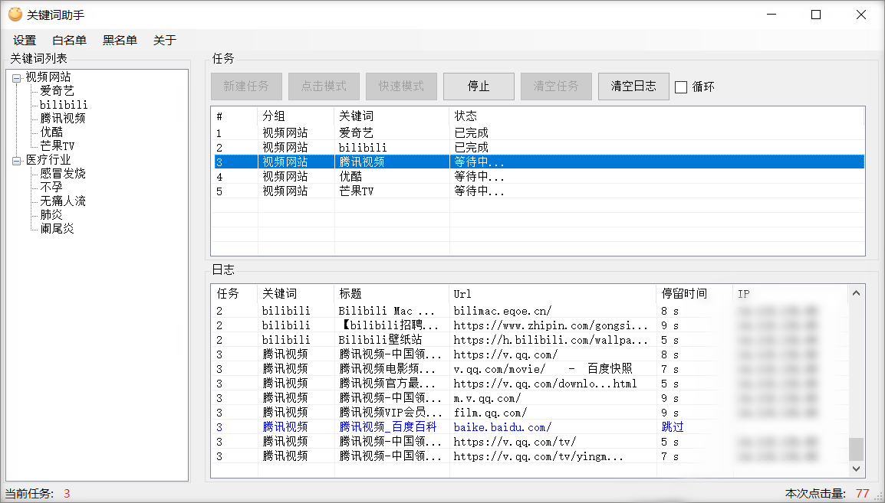

# KWAssistant
百度关键词助手，刷点击，可设置页数、黑/白名单。  
支持以下两种模式：
- 快速模式：使用 `HttpClient` 请求资源
- 点击模式：使用内置浏览器模拟点击，可设置间隔时间、停留时间等。

## Requirements
- VC++ 2013/2015
- .NET Framework 4.6.2 或 更高

## Download
百度云：[https://pan.baidu.com/s/1y9w3PxiX5JIpWhOL2_W46A](https://pan.baidu.com/s/1y9w3PxiX5JIpWhOL2_W46A) 提取码：02ot
## Screenshot

## Thank
- [CefSharp](https://github.com/cefsharp/CefSharp)
- [AngleSharp](https://github.com/AngleSharp/AngleSharp)
- [Newtonsoft.Json](https://github.com/JamesNK/Newtonsoft.Json)